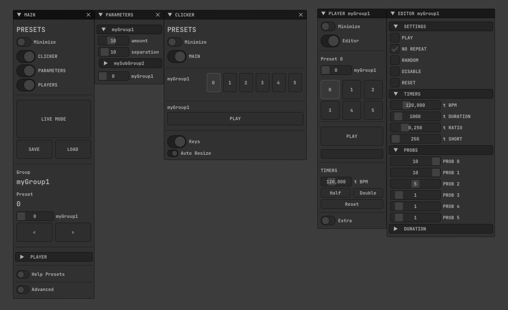
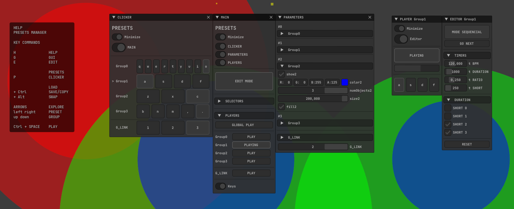

ofxPresetsManager
=============================

# Overview

An **openFrameworks** add-on to handle presets of several `ofParameter`'s nested into single or multiple `ofParameterGroup` containers.  

Also *powered* with a *nice GUI* and many *Helpers* and customizations.

**NOTE**  
_If you don't need multiple and independent and linkeable groups,_  
_then I recommend to use my simpler add-on [ofxSurfingPresets](https://github.com/moebiussurfing/ofxSurfingPresets)._  

#### 1_Basic (only one group)

  

## Features

- Handling of several nested `ofParameter`'s into `ofParameterGroup`'s as containers.
- Easy to integrate into your projects.
- Autogenerates a GUI to tweak all the parameters.
- GUI based on **Dear ImGui** using a fork of **ofxImGui**.
- Lot of customizations, **Tools, and Helpers**:  
  * Clone, Copy, Swap and **Organize Presets**.
  * Play BPM Timed **Randomizer** to switch between presets (tweaking probabilities) independent for each group.
  * **Randomize** some selected **parameters** for a Preset. [Deprecated?]
  * Handle **Many Groups** independently. **Browse** multi groups and presets by **arrows keys**.
  * **Undo** history engine.

## **Multi Groups**

When adding individually multiple `ofParameterGroup` we can handle them independently.  
We can use arrow keys to browse the groups and their selectors.  
Also, we will have an extra **Global Selector** called **GROUP_LINK**, which groups all the other group selectors states:  

#### 2_MultiGroup



## **Two Types of Presets**

1. **Favorite Presets**:  
   Fast clickable-boxes/key-trigged presets.  

2. **Standalone Presets**:  
   Archived and named presets that we can load into and from favorites.  

## Two Working Modes

1. **Edit Mode**:  
   Auto saves parameters changes when switching between presets.  
   Used to allow fast edition of the parameters.  

2. **Live Mode**:  
   Disables auto save and hides some GUI sections to simplify and improve performance.  
   Used when just playing the scenes. (We can save manually.)

## **Two Randomizer Engines**

1. **RANDOM SELECTED INDEX**:  
   To select a preset index by random and probabilities, customizable tempo, and two types of preset/states durations: normal and short. 

2. **RANDOM EDIT**: [Deprecated?]  
   To randomize some enabled parameters from the current preset.  

## Usage

1. Set up your scene and `initialize` the related ```ofParameter```'s.
2. ```Add``` the parameters ```to``` the ```ofParameterGroup container```.
3. ```Add``` the group ```to the add-on```. 
4. Set ```how many presets``` you want for the group, ```and what keys``` to associate as triggers.
5. ```Done!``` Just Play with the addon GUI (or using the API control methods by code).  

Look at the examples and ```ofxPresetsManager.h``` for more learning.  
The file settings (one file for each preset) will be placed by default into ```/bin/data```.  

**ofApp.h**

```c++
#include "ofxPresetsManager.h"

ofxPresetsManager presetsManager;

ofParameterGroup params; // group params container
ofParameter<int> shapeType;
ofParameter<int> amount;
```

**ofApp.cpp**

```c++
ofApp::setup()
{
    // 1. Set the scene parameters 
    // 2. Add them to the ofParameterGroup container. 
    params.setName("sceneParamsGroup");    
    params.add(shapeType.set("shapeType", 1, 1, 2));
    params.add(amount.set("amount", 10, 1, 24));

    // 3. Add the group to preset manager
    // 4. Set the amount of presets and each key triggers 
    presetsManager.add(params, { 'a', 'b', '0', '1', '2', '3' });
    presetsManager.setup();
}

ofApp::draw()
{
    // 5. Gui
    presetsManager.draw();
}

// 6. Done!
// Nothing more!
// Your parameters are auto updated.
```

## About the examples

### /Examples

#### **1_example-Basic**:
Illustrates how to handle some ```ofParameter```'s bundled into one ```ofParameterGroup``` used as a container.  

#### **2_example-MultiGroup**:
Helps to learn how to handle multiple `ofParameterGroup`'s.  
  
```.cpp
// group 0
presetsManager.add(params0, { 'q', 'w', 'e', 'r', 't' });
// group 1
presetsManager.add(params1, { 'a', 's', 'd', 'f' });
// group 2
presetsManager.add(params2, { 'z', 'x', 'c' });
// group 3
presetsManager.add(params3, { 'b', 'n', 'm', ',', '.' });

presetsManager.setup();
```

### /ExamplesAdvanced
#### **3A_example-LinkServer** and **3B_example-LinkClient**:
Both examples runs linked together using **ofxRemoteParameters**. This allows you to control the presets on the **Client OF_App**. The **Server OF_App** draws your scene using the *linked/received* parameters from the **Client OF_App**. This is useful because in some scenarios could help to improve the performance or the compiling time reducing dependencies. [OUTDATED VIDEO](http://www.youtube.com/watch?v=kV-t8lIdNRg "VIDEO") 

## Dependencies
* [ofxImGui](https://github.com/Daandelange/ofxImGui/tree/jvcleave) / _Fork from  @Daandelange_
* [ofxSurfingHelpers](https://github.com/moebiussurfing/ofxSurfingHelpers)  
* [ofxRemoteParameters](https://github.com/c-mendoza/ofxRemoteParameters) / _Not required. For the examples 3A-3B_  

The below add-ons are already packed into **OF_ADDON/libs/** or into **ofxSurfingHelpers**.  
No need to add them manually with the **oF PROJECT GENERATOR**:  
* [ofxUndo](https://github.com/nariakiiwatani/ofxUndo)
* [ofxScaleDragRect](https://github.com/moebiussurfing/ofxScaleDragRect) / _Fork_
* [ofxMSAInteractiveObject](https://github.com/moebiussurfing/ofxMSAInteractiveObject) / _Fork_

## Thanks
_Thanks to all the above add-ons coders!_  

_Special Thanks to **Nicola Pisanti** for the original https://github.com/npisanti/ofxGuiPresetSelector  
which inspired this add-on a lot. Some of his code is also used here._

_Special Thanks 2 goes to **@Daandelange**_ for his work to the DEFINITIVE **ofxImGui** repository. Thanks **Daan**!  

## Tested Systems
- **Windows10** / **VS2017** / **OF ~0.11+**
- Should work on **macOS** too.  

## Notes / TODO
* A Better performant version without using hard disk files.  
**Memory Mode**, using a vector of XML/JSON instead of files.
* Improve (silent) de-serialization and ofParameter callbacks / triggering to improve speed.
* Add params tweening or filtering to ease transitions between presets when switching.
* Add a minimal/lite class to play compatible preset files but without any GUI or using a tiny **ofxGui**/**ImGui** version.
* More ideas noted into **ofxPresetsManager.h**.   
* **Feedback**, **Issues**, **PR**'s, and any kind of help are very welcome!

## Author
An add-on by **@moebiusSurfing**  
*( ManuMolina ) 2019-2022*

## License
*MIT License*